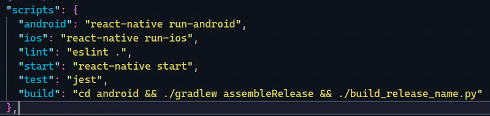

# React Native Build Android Release APK 
This is a simple python Scr1pt that automate the rename release apk from react native ` yarn build `.

## How to download
Following the next steps:
```
git clone https://github.com/mr0xff/android-build-apk.git
```
### Copy to your react native project root 
Like this ` my-app/android `

### C0nf1gur3 your ` package.json ` 
Like this 

 

*Bye :)*
